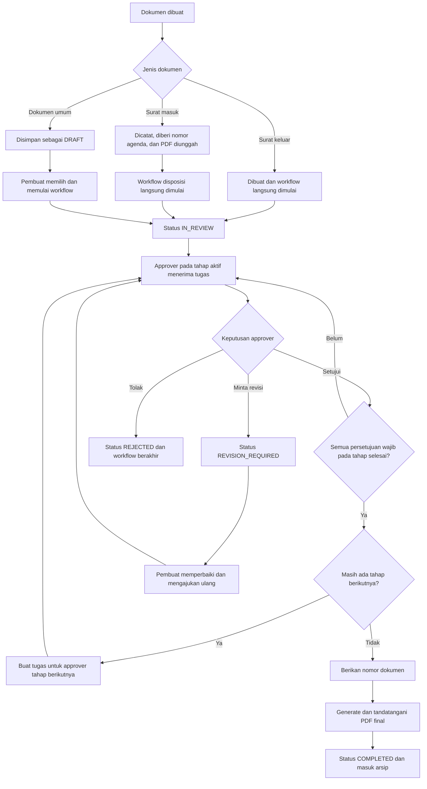

# E-Office

E-Office adalah aplikasi pengelolaan dokumen dan persuratan berbasis web. Sistem ini membantu proses pembuatan, pengajuan, pemeriksaan, persetujuan, pengarsipan, serta verifikasi dokumen secara terstruktur.

> **Status proyek: masih dalam tahap pengembangan**
>
> Fitur, struktur data, dan integrasi dapat berubah sewaktu-waktu. Aplikasi belum dianggap sebagai rilis produksi final sehingga pengujian dan validasi tambahan tetap diperlukan sebelum digunakan pada lingkungan operasional.

## Gambaran Umum

Sistem dirancang untuk mendukung alur administrasi dokumen secara terpusat, antara lain:

- pembuatan dokumen internal dan persuratan;
- pencatatan dokumen masuk dan dokumen keluar;
- pengunggahan serta pengelolaan berkas dokumen;
- disposisi dan tindak lanjut dokumen;
- workflow persetujuan berdasarkan tahapan dan kewenangan;
- penomoran dokumen;
- pembuatan dokumen final dalam format PDF;
- validasi dokumen menggunakan QR code;
- notifikasi dan pencatatan aktivitas;
- penyimpanan dokumen yang telah selesai ke arsip.

## Workflow Sistem

Workflow bersifat dinamis dan dapat dikonfigurasi per jenis dokumen serta, bila
diperlukan, dibatasi untuk unit kerja tertentu. Setiap workflow memiliki satu atau
lebih tahap persetujuan. Approver pada setiap tahap dapat ditentukan berdasarkan
pengguna, jabatan, jabatan dalam unit dokumen, role, atau permission.



### Tahapan proses

1. **Pembuatan dan pengajuan dokumen**
   - Pengguna membuat dokumen sesuai jenisnya dan dapat menambahkan metadata
     serta berkas PDF pendukung.
   - Dokumen umum disimpan sebagai `DRAFT`, kemudian pembuat memilih workflow
     aktif yang sesuai dengan jenis dokumen dan unit kerjanya.
   - Surat keluar dan surat masuk memulai workflow yang dipilih langsung saat
     data disimpan. Surat masuk juga memperoleh nomor agenda otomatis.

2. **Pemeriksaan dan persetujuan**
   - Saat workflow dimulai, status dokumen menjadi `IN_REVIEW` dan sistem
     membuat tugas bagi seluruh approver pada tahap pertama.
   - Approver dapat menyetujui, meminta revisi, atau menolak dokumen apabila
     tindakan tersebut diizinkan pada konfigurasi tahap.
   - Pada tahap wajib dengan beberapa approver, proses baru berlanjut setelah
     seluruh persetujuan yang masih menunggu pada tahap tersebut selesai.
   - Setelah sebuah tahap selesai, sistem membuat tugas dan notifikasi untuk
     approver pada tahap berikutnya.

3. **Revisi, pengajuan ulang, dan penolakan**
   - Permintaan revisi mengubah status menjadi `REVISION_REQUIRED` dan
     mengembalikan dokumen kepada pembuat beserta catatan approver.
   - Pembuat dapat memperbaiki dokumen lalu mengajukannya kembali. Sistem
     membuat siklus persetujuan baru pada tahap yang sama.
   - Penolakan mengubah status dokumen dan workflow menjadi `REJECTED`, lalu
     menghentikan proses persetujuan.

4. **Finalisasi dan pengarsipan**
   - Setelah tahap terakhir disetujui, sistem memberikan nomor dokumen sesuai
     aturan penomoran yang berlaku.
   - Sistem menghasilkan PDF final, menjalankan proses penandatanganan, dan
     menyertakan QR code yang mengarah ke halaman verifikasi publik.
   - Status dokumen menjadi `COMPLETED`, waktu arsip dicatat, dan dokumen dapat
     diakses melalui menu Arsip.

5. **Disposisi dan tindak lanjut**
   - Pengguna yang berwenang dapat meneruskan dokumen kepada pengguna, jabatan,
     atau unit tujuan disertai instruksi dan tenggat waktu.
   - Penerima mengelola disposisi melalui status `UNREAD`, `READ`,
     `IN_PROGRESS`, hingga `COMPLETED`.
   - Seluruh pembuatan dokumen, keputusan workflow, pengajuan ulang, dan
     perubahan status disposisi dicatat pada log aktivitas. Notifikasi dikirim
     kepada pihak terkait pada setiap tindakan penting.

### Ringkasan status

| Status | Keterangan |
| --- | --- |
| `DRAFT` | Dokumen masih disiapkan dan belum masuk workflow. |
| `IN_REVIEW` | Dokumen sedang menunggu persetujuan pada tahap aktif. |
| `REVISION_REQUIRED` | Dokumen perlu diperbaiki oleh pembuat. |
| `REJECTED` | Dokumen ditolak dan workflow dihentikan. |
| `DISPOSITIONED` | Dokumen telah diteruskan melalui disposisi. |
| `COMPLETED` | Seluruh tahap selesai dan dokumen telah diarsipkan. |

## Stack Teknologi

### Backend

- **PHP 8.2 atau lebih baru**
- **Laravel 12**
- **Laravel Eloquent ORM**
- **Laravel Blade** untuk server-side rendering
- **SQLite** sebagai konfigurasi database bawaan pengembangan
- **Laravel Queue** dengan database driver untuk pekerjaan antrean

### Frontend dan asset

- **Vite 7**
- **Tailwind CSS 4**
- **Axios**
- JavaScript dan CSS yang dikelola melalui Laravel Vite Plugin

### Pemrosesan dokumen

- **Dompdf** untuk menghasilkan PDF
- **Endroid QR Code** untuk membuat QR code validasi dokumen
- Layanan penandatanganan saat ini menjadi abstraction boundary dan dapat diintegrasikan dengan provider tersertifikasi pada tahap berikutnya.

### Pengujian dan tooling

- **PHPUnit 11**
- **Laravel Pint**
- **Laravel Sail** (opsional)
- **Concurrently** untuk menjalankan beberapa proses development secara bersamaan

## Struktur Direktori Utama

```text
app/
├── Http/          Controller dan Form Request
├── Models/        Model Eloquent
├── Notifications/ Notifikasi aplikasi
├── Policies/      Aturan otorisasi
└── Services/      Logika workflow, penomoran, PDF, notifikasi, dan aktivitas

database/
├── migrations/    Struktur tabel dan perubahan skema
└── seeders/       Data awal (jika tersedia)

resources/
├── css/           Style aplikasi
├── js/            Entry point JavaScript
└── views/         Template Blade

routes/             Definisi navigasi dan proses aplikasi
storage/            File runtime dan hasil generate aplikasi
tests/              Pengujian otomatis
```
